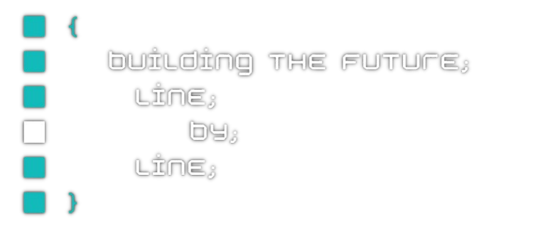

 
  
# 
    
  $> Hello world!

Tech enthusiast and problem-solver with a passion for learning. 
 

<!-- -->

I'm a 34-year-old electronics repair technician at Worten Resolve, specializing in a wide range of devices from smartphones to home appliances.

My curiosity drives me to constantly explore new technologies and software. I enjoy hands-on work and am always eager to take on new challenges. Efficiency is important to me, and I've developed methods to manage time effectively.

While I thrive in the fast-paced world of technology, I also value tranquility and focus in my personal life. 
 I'm currently expanding my skills through programming projects at **42 school**, aiming to combine my practical experience with new software development knowledge.

Always open to collaboration and excited to contribute to innovative projects!

---
###### Currently learning
<!-- 

  

 -->

	<code></code>
	<code></code>
	<code></code>
	<code></code>
	<code></code>
	<code></code>
	<code></code>
	<code></code>

---
###### As a technician at Worten Resolve, I work with

	<code></code>
	<code></code>
	<code></code>
	<code></code>
	<code></code>
	<code></code>

---

###### Some software and languages that I've been working with over time

###### From green to red according to experience

<!--  -->

---
 
 
 
 

  
 

